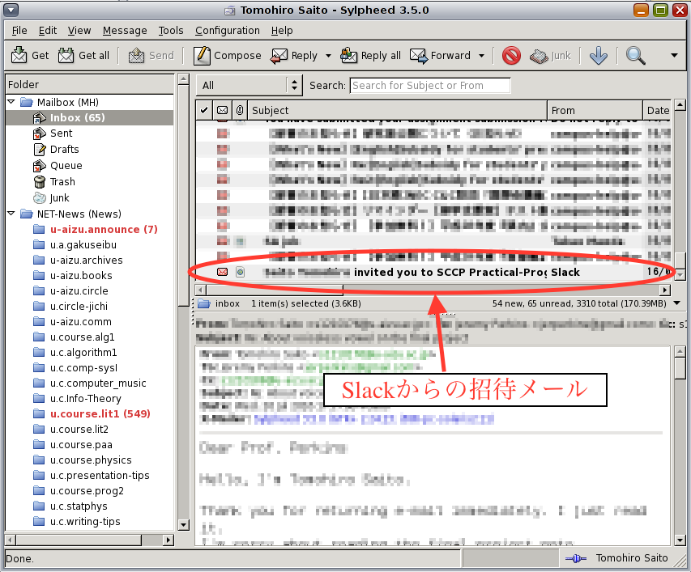
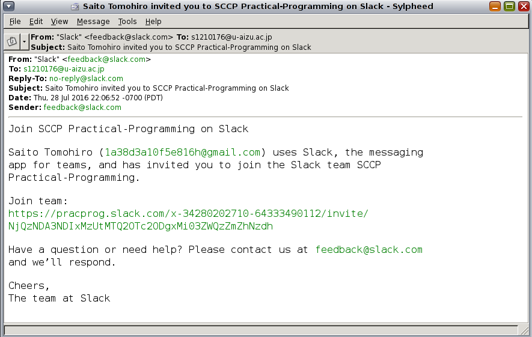
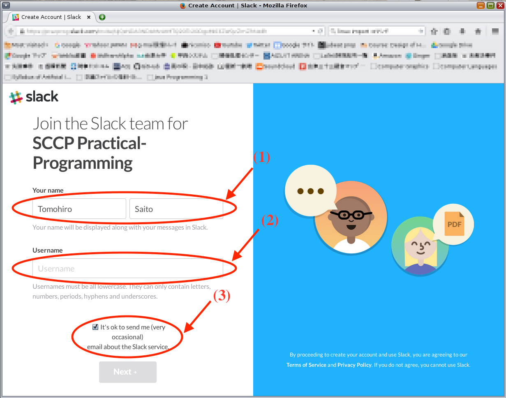
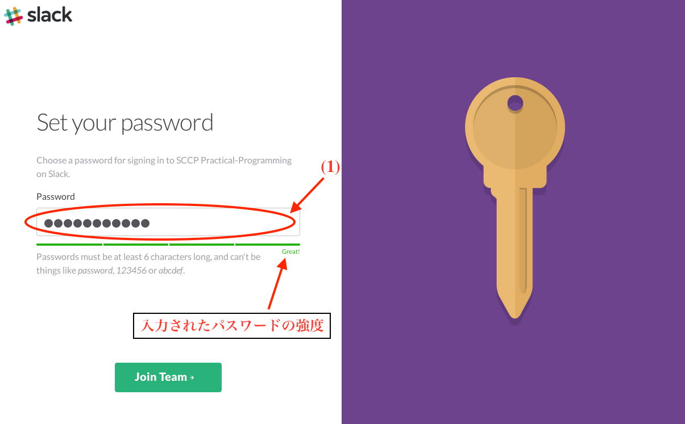
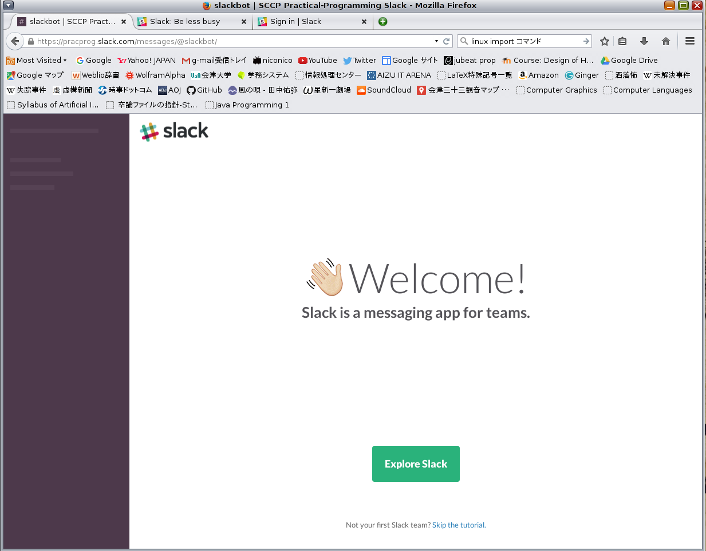
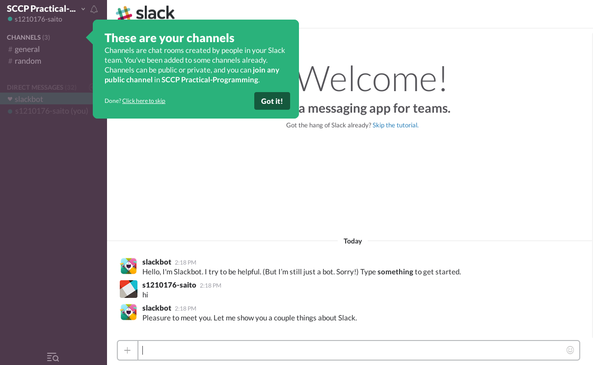

# Slack登録チュートリアル  
実践的プログラミング  
齊藤智博 DBSystem講座 141-f

## Slackについて
Slackとは、国内外で注目を集めている、web上の多機能チャットサービスです。Slackには専門的なコミュニケーションに特化した機能が多く含まれており、例えば利用することによって以下のような恩恵が得られます。

- チームでも1対1でも、ストレスのないリアルタイムのコミュニケーションができる
- パソコン、スマホ、タブレットなど、閲覧環境を選ばずサクサク使える
- 過去のやりとりの中であとで参照したいものを保存でき、検索も簡単
- 画像を含めたどんな種類のファイルでも、手軽に共有できる
- 業務で使用している他のサービスと連携させ、仕事を効率化することができる

([引用](https://seleck.cc/note/seleck_howto/article/8))

本課題プロジェクト（以下SCCP）では、履修する皆さんには実際にSlackのサービスを通して幾つかの課題を行ってもらいます。もちろんSCCP内で出された課題だけでなく、学生生活や定期試験についてや美味いラーメン屋などについての質問も受付しているので、是非気軽に利用して下さい。  
Slack参加への具体的な方法は、以下の節で説明します。

**今後SCCPの全ての回でSlackを使うことになるので、必ず第一回のSCCPが始まる前までに以下の手順に従ってSCCPのチームへの登録を済ませて来て下さい。**

## 課題プロジェクト専用Slackへの参加
（注意）SCCPの専用Slackへの参加は、メールを読むことが出来れば演習室5,6のiMac系からでも、自分のPC上からでも、手持ちの携帯端末からでも行うことが出来ますが、実際に課題プロジェクトを行う演習室1,2,3,4のSolaris系のワークステーションで行い、講義が行われる環境に慣れておくのがベストです。  
例年SCCPが始まると、Slackに登録したパスワードを忘れてしまったり、登録のミスなどの理由で活動に参加出来ないと言う生徒が散見されます。

### 1. 招待メール確認
本SCCPの専用Slackのチームへの招待は、履修者の学内メール宛に送信されます。メールが届いていることを確認するために、まずメーラーを起動しましょう。既にリテラシーIの講義などで使い方を習ったと思いますが、例えばSylpheedはターミナル上にて以下のコマンドで起動出来ます。

```
$ sylpheed &
```

Solaris端末を使っている場合は下の画像のように画面上部のショートカットより起動しても良いでしょう。


Sylpheedが起動したら、Inboxを確認し、招待メールを確認しましょう。招待メールは

* \*\*\* invited you to SCCP Practical-Programming on Slack
というタイトルで、送信元がSlackとなっています。


もしメールがすぐに見付からない場合は、検索窓にSlackなどの文字を打ち込みメールを探してみましょう。
どうしても招待メールが見付からない場合、こちらの登録漏れの可能性もありますので、第一回のSCCPが開始するまでに担当の教授及びSA/TAへメールで連絡を下さい。SA/TAのメールは大学HPで公開されているこの課題プロジェクトのメーリングリストに記載されています。

無事招待メールが見付かったらメールの中身を見てみましょう。

メール本文中にある、Join team:の下のhttp://pracprog.slack.com/から始まるリンクをクリックしましょう。

### 2. アカウント作成
既にSlackのアカウントを持っている方はアカウント作成の過程は省略されます。
#### 本名・ユーザー名の登録

このページでは、Slack内で使用される **本名** 及び **ユーザー名** の入力が求められます。  
 - **(1)** First nameとLast nameに気をつけて、自分の本名を入力しましょう。

 - **(2)** ユーザー名を入力しましょう。ここで、本SCCPでは履修者は[学籍番号]-[苗字]という書式に従ってユーザー名を作成します。  

```
例：
学籍番号が「s1990999」で本名が「会津太郎」だった場合、
ユーザー名は s1990999-aizu
（ユーザー名は全て小文字で入力しましょう）
```

 - **(3)** このチェックボックスでは、Slackの提供するサービスについてのお知らせをメールで受け取るかどうかを選択出来ます。特に必要なければチェックを外しても良いでしょう。  

すべての入力が終わったら、ページ下にある **Next** ボタンを押しましょう。  

#### パスワードの登録

この画面ではSlackサービスにログインする際使われるパスワードの入力が求められます。自分で覚えやすく、かつ他人に分からないようなパスワードを設定するように心がけましょう。  
Slackで設定出来るパスワードには英小文字だけでなく、英大文字や数字、記号も含むことができます。
パスワード入力欄の下にある、ゲージが緑色になるようなパスワードをなるべく設定しましょう。
パスワードを覚えていられる自信がない人は、使っているブラウザに搭載されているパスワードの保存機能を使いましょう。

もしパスワードを忘れてしまった場合でも、登録したメールアドレス（今回は学内アドレス宛に招待メールを送ったので、学内アドレスになります）からパスワードのリセットを行うことが出来ます。忘れた場合は **早急に対処しましょう**。

#### Slackログイン


この画面まで辿り着いたら、アカウントの作成は終了です。緑色の枠に囲まれた、**Explore Slack** のボタンを押すと、画面にSlackのbotからのメッセージが表示されます。


このbotに対して、下のメッセージ入力欄にて何らかの言葉を送ると、Slackのメニューについての簡単なチュートリアルが開始します。説明は全て英語ですが、SCCPを通してSlackは何度も使うことになるのでよく読んでおきましょう。  
もし必要ならばインターネット上でSlackについて解説してくれているサイトはたくさんあるので、探して見るのも良いでしょう。

SCCP専用Slackへの参加のチュートリアルは以上になります。
